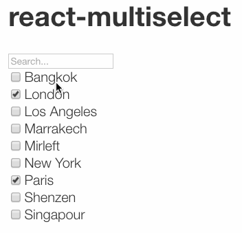

# ${pkg.name}

${badge('npm')} ${badge('license')} ${badge('github-issues')}  ${badge('circleci')}

${pkg.description}

${badge('nodei')}



## Install

`npm install --save ${pkg.name}`

## Usage


```js
let props = {
  choices: [
    {
      text: 'Paris',
      value: 'PAR'
    },{
      text: 'New York',
      value: 'NYC'
    },{
      text: 'London',
      value: 'LDN'
    }, {
      text: 'Marrakech',
      value: 'MRK'
    }, {
      text: 'Singapour',
      value: 'SNG'
    }, {
      text: 'Bangkok',
      value: 'BKK'
    }, {
      text: 'Mirleft',
      value: 'MIR'
    }, {
      text: 'Shenzen',
      value: 'SHE'
    }, {
      text: 'Los Angeles',
      value: 'LA'
    }
  ],
  checked: ['LDN', 'PAR'],
  onChange: selection => {
    console.log('selection', selection);
  }
}
return <ReactMultiselect { ...props }/>;
```

## Scripts

${scripts()}

## Dependencies

${dependencies()}

## Contributing

Contributions welcome; Please submit all pull requests the against master branch. If your pull request contains JavaScript patches or features, you should include relevant unit tests. Thanks!

## Author

${pkg.author.name} <${pkg.author.email}> ${pkg.author.url}

## License

${license()}
