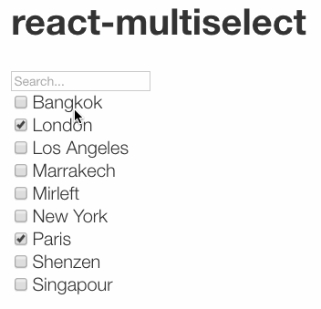

# react-multiselect-revolunet

    

simple search + multi-selection react widget




## Install

`npm install --save react-multiselect-revolunet`

## Usage


```js
let props = {
  choices: [
    {
      text: 'Paris',
      value: 'PAR'
    },{
      text: 'New York',
      value: 'NYC'
    },{
      text: 'London',
      value: 'LDN'
    }, {
      text: 'Marrakech',
      value: 'MRK'
    }, {
      text: 'Singapour',
      value: 'SNG'
    }, {
      text: 'Bangkok',
      value: 'BKK'
    }, {
      text: 'Mirleft',
      value: 'MIR'
    }, {
      text: 'Shenzen',
      value: 'SHE'
    }, {
      text: 'Los Angeles',
      value: 'LA'
    }
  ],
  checked: ['LDN', 'PAR'],
  onChange: selection => {
    console.log('selection', selection);
  }
}
return <ReactMultiselect { ...props }/>;
```

## Scripts

 - **npm run test** : `rackt test`
 - **npm run test-chrome** : `./node_modules/.bin/testem -l Chrome`
 - **npm run start** : `rackt server`
 - **npm run readme** : `node-readme`

## Dependencies

Package | Version | Dev
--- |:---:|:---:
[node-readme](https://www.npmjs.com/package/node-readme) | 0.1.9 | ✔
[rackt-cli-revolunet](https://www.npmjs.com/package/rackt-cli-revolunet) | ^0.5.10 | ✔
[react](https://www.npmjs.com/package/react) | ^0.14 | ✔
[react-dom](https://www.npmjs.com/package/react-dom) | ^0.14 | ✔


## Contributing

Contributions welcome; Please submit all pull requests the against master branch. If your pull request contains JavaScript patches or features, you should include relevant unit tests. Thanks!

## Author

Julien Bouquillon <julien@bouquillon.com> http://github.com/revolunet

## License

 - **MIT** : http://opensource.org/licenses/MIT
